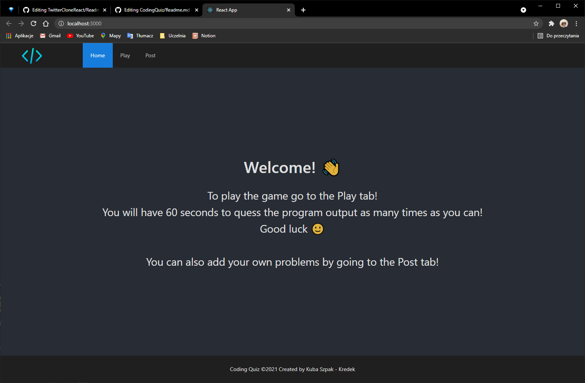
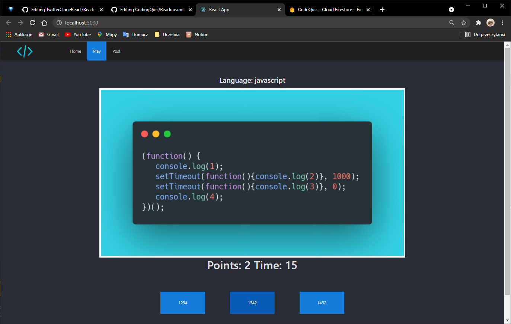
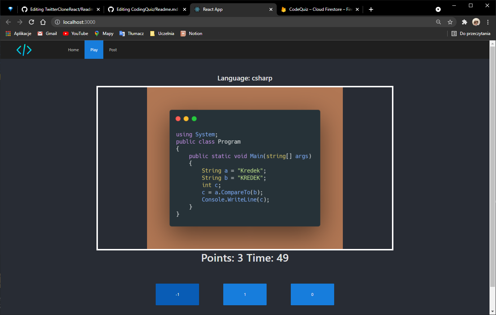
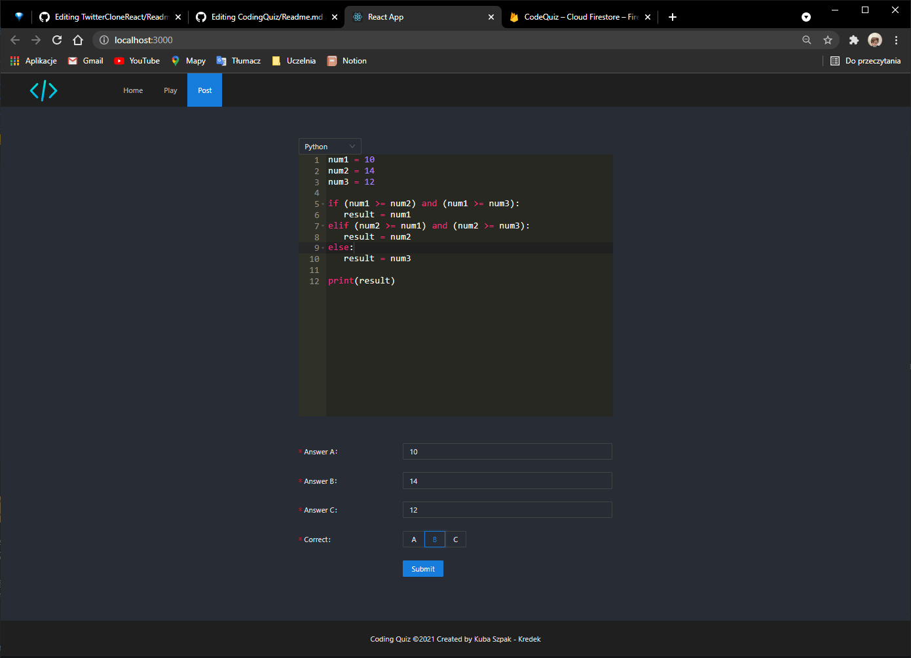

# Quiz


### Technology stack
</br>

Programming Quiz with frontend in React (Ant design UI Library) and backend in Node (Express) </br>
Application stores data with the help of a firebase database. </br>
The post subpage uses the Ace Editor component to enable code edition within the website. </br>
Generating quiz images is handled by the [Carbonara API](https://github.com/petersolopov/carbonara) </br> </br>
Disclaimer: Unfortunatelly the firebase database config is not attached to the code as I cannot publish my API token. If you are interested in testing the app contact me or create a firebase application and copy the initial configuration to quiz/src/firebase/config.js file.
</br>
</br>

## Description and preview
</br>



 </br> </br>

## Quiz

</br>
The Play subpage allows one to try their luck in a programming quiz. The questions are drawn from the firebase database. Every question has 3 potential answers and always only 1 is correct. Player has 60 seconds to get as many points as possible.
</br></br>



</br></br>




 </br>
  </br>

## Post
</br>

When the backend is running, user can post new questions to the database by filling the editor with the specified piece of code and choosing 3 potential answers with the one being correct. To use the database - create a firebase application and copy the initial configuration to quiz/src/firebase/config.js file.

</br>



## Start

To start the server cd into server directory and run
```bash
node .
```

then cd into quiz directory and start frontend by running
```bash
npm start
```

</br>

## Kredek Lab8

This application was created as a homework for a university coding club [Kredek](https://www.facebook.com/KNKredek)

</br>
